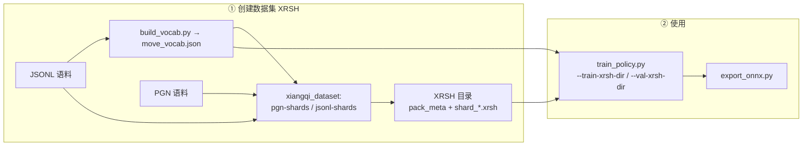

# xiangqi-review-nn（Python 训练栈）

仓库根目录 **`README.MD`** 描述 Monorepo 全貌；本节为 **`nn/`** 的安装与命令。

产品边界、方法论与契约见根目录 **`ARCHITECTURE.md`**。

## 依赖

```bash
cd nn
pip install -e .
pip install -e ".[train]"   # PyTorch 训练与 ONNX 导出
```

核心运行时：`pyffish`（规则与合法着）、`tqdm`。训练额外需要 `torch`。

**训练数据**：仅支持 **XRSH**（Rust `xiangqi_dataset` 生成的 `shard_*.xrsh` + `pack_meta.json`）。**`xrsh_v2`** 在分片内带 **attack/danger/tactical** 三 float（`xiangqi_core` 预计算）；**`xrsh_v1`** 仍可读。多头训练时 v2 样本 **不再** 在 `__getitem__` 为辅助头调用 pyffish。

---

## 数据集创建与使用流程（总览）

整体分为两段：**先用 Rust 产出 XRSH**，**再用 Python 训练 / 导出 ONNX**。词表必须由 **`scripts/vocab/build_vocab.py`** 从 JSONL 汇总得到；**XRSH 与训练必须使用同一份 `move_vocab.json`**（`pack_meta.json` 里的 `vocab_sha256` 会校验）。



| 阶段 | 谁做 | 输入 | 输出 |
|------|------|------|------|
| 词表 | Python `scripts/vocab/build_vocab.py` | 一条或多条 JSONL（扫描 `human_move_pyffish`） | `move_vocab.json` |
| 分片 | Rust `cargo run -p xiangqi_dataset -- …` | 同上词表 + PGN **或** JSONL | 每个语料一个目录：`pack_meta.json`、`shard_*.xrsh` |
| 训练 | Python `scripts/train/train_policy.py` | 训练/验证 **XRSH 目录** + **同一词表** | `policy.pt` |
| 部署（可选） | `scripts/export/export_onnx.py` | checkpoint | `.onnx` |

**划分 train / val 的推荐方式**：按**不同语料文件**分别生成 XRSH（例如 dpxq → `xrsh_train`，WXF → `xrsh_val`），而不是在同一大 JSONL 里按局随机切分。

### 词表 → XRSH（命令）

**1. 词表**（在 `nn/` 下执行；可指定多个 `--jsonl` 覆盖 train∪val 出现过的走法）：

```bash
python scripts/vocab/build_vocab.py --jsonl data/train.jsonl --jsonl data/val.jsonl --out data/move_vocab.json
```

**2a. PGN → XRSH**（在**仓库根目录**执行，每个 PGN 输出到独立目录）：

```bash
cargo run -p xiangqi_dataset -- pgn-shards --pgn pgns/dpxq-99813games.pgns --vocab data/move_vocab.json --out-dir data/xrsh_train --jobs 0 --games-per-shard 500
cargo run -p xiangqi_dataset -- pgn-shards --pgn pgns/WXF-41743games.pgns --vocab data/move_vocab.json --out-dir data/xrsh_val --jobs 0 --games-per-shard 500
```

**2b. 已有 JSONL → XRSH**（仍在仓库根目录）：

```bash
cargo run -p xiangqi_dataset -- jsonl-shards --jsonl data/train.jsonl --vocab data/move_vocab.json --out-dir data/xrsh_train --jobs 0
cargo run -p xiangqi_dataset -- jsonl-shards --jsonl data/val.jsonl --vocab data/move_vocab.json --out-dir data/xrsh_val --jobs 0
```

Rust 子命令与字段说明见 **`crates/xiangqi_dataset/README.md`**。

### 训练与导出

```bash
cd nn
python scripts/train/train_policy.py --train-xrsh-dir ../data/xrsh_train --val-xrsh-dir ../data/xrsh_val --vocab ../data/move_vocab.json --out ../data/checkpoints/policy.pt --device cuda --epochs 30
python scripts/export/export_onnx.py --checkpoint ../data/checkpoints/policy.pt --out ../data/policy.onnx
```

静态 **batch=1**，输入 `board`：`float32[1,15,10,9]`。默认训练带 **多头**，ONNX 输出 **`logits`**（`float32[1,V]`）及 **`attack` / `danger` / `tactical`**（各 `float32[1]`，**导出图中已为 sigmoid 概率**）；仅单 policy 时加训练参数 `--no-aux-heads`，导出则仅 `logits`。

---

### 小规模试跑（smock）

已有 `data/smock_train.jsonl`、`data/smock_val.jsonl` 与 `data/smock_vocab.json` 时，先在**仓库根目录**生成 XRSH，再进入 `nn/` 训练：

```bash
cargo run -p xiangqi_dataset -- jsonl-shards --jsonl nn/data/smock_train.jsonl --vocab nn/data/smock_vocab.json --out-dir nn/data/smock_xrsh_train --jobs 0
cargo run -p xiangqi_dataset -- jsonl-shards --jsonl nn/data/smock_val.jsonl --vocab nn/data/smock_vocab.json --out-dir nn/data/smock_xrsh_val --jobs 0
cd nn
python scripts/train/train_policy.py --train-xrsh-dir ../data/smock_xrsh_train --val-xrsh-dir ../data/smock_xrsh_val --vocab ../data/smock_vocab.json --out ../data/checkpoints/smock_policy.pt --width 64 --blocks 4 --batch-size 256 --epochs 2 --device cpu
python scripts/export/export_onnx.py --checkpoint ../data/checkpoints/smock_policy.pt --out ../data/smock_policy.onnx
```

（路径可按实际数据位置调整；试跑建议 `--epochs 2`、`--device cpu` 等。）

默认 `--device cuda`；仅 CPU 时可显式 `--device cpu`。

---

## 测试

```bash
pip install -e ".[dev]"
pytest
```

未安装 `torch` 时会跳过 `tests/test_nn_smoke.py`。

### xiangqi_core ↔ pyffish 合法 UCI 对拍

依赖：`pyffish`（随 `pip install -e .`）、系统 **`cargo`**。在 **`nn/`** 下：

```bash
python scripts/parity/pyffish_xiangqi_core_parity.py -v
```

或仅跑该项：`pytest tests/test_pyffish_xiangqi_core_parity.py`。Rust 侧二进制说明见 **`crates/xiangqi_core/README.md`**。
