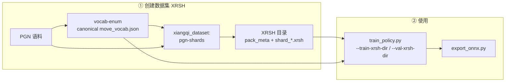

# xiangqi-review-nn（Python 训练栈）

仓库根目录 **`README.MD`** 描述 Monorepo 全貌；本节为 **`nn/`** 的安装与命令。

训练栈服务于 **人类认知驱动的搜索**：**policy / 语义头** 学大师棋谱与人类局面特征，用于引擎侧 **剪枝与排序先验**；**不是**以「复刻外部引擎静态评估」为默认目标。完整边界与契约见根目录 **`ARCHITECTURE.md`**。

## 依赖

```bash
cd nn
pip install -e .
pip install -e ".[train]"   # PyTorch 训练与 ONNX 导出
```

核心运行时：`pyffish`（规则与合法着）、`tqdm`。训练额外需要 `torch`。

**训练数据**：仅支持 **XRSH v3**（Rust `xiangqi_dataset` 生成的 `shard_*.xrsh` + `pack_meta.json`）。`xrsh_v3` 包含 **辅助头三标量 + 对局结果 + 总步数**（供 **value 头**，见 `nn.dataset_xrsh`）；训练步不再为辅助头调用 pyffish。

---

## 数据集创建与使用流程（总览）

整体分为两段：**先用 Rust 生成固定 canonical 词表与 XRSH**，**再用 Python 训练 / 导出 ONNX**。词表主线由 **`vocab-enum`** 直接确定性生成；**XRSH 与训练必须使用与分片一致的 `move_vocab.json`**（`pack_meta.json` 里的 `vocab_sha256` 会校验）。不再把“从 PGN 扫词表”作为常规流程。



| 阶段 | 谁做 | 输入 | 输出 |
|------|------|------|------|
| 词表 | Rust `vocab-enum` | 无（规则几何直接枚举） | `move_vocab.json` |
| 分片 | Rust `cargo run -p xiangqi_dataset -- pgn-shards …` | 词表 + PGN | 每个语料一个目录：`pack_meta.json`、`shard_*.xrsh` |
| 训练 | Python `scripts/train/train_policy.py`（**默认含 value 头**，`--no-value-head` 可关） | 训练/验证 **XRSH v3** + **同一词表** | `policy.pt` |
| 部署（可选） | `scripts/export/export_onnx.py` | checkpoint | `.onnx` |

**划分 train / val 的推荐方式**：按**不同 PGN 文件**分别生成 XRSH（例如 dpxq → `xrsh_train`，WXF → `xrsh_val`）。

### 词表 → XRSH（命令）

**1. 词表**（**仓库根目录**；固定 canonical 词表）：

```bash
cargo run --release -p xiangqi_dataset -- vocab-enum --out data/move_vocab.json
```

**2. PGN → XRSH**（在**仓库根目录**执行，每个 PGN 输出到独立目录）：

```bash
cargo run --release -p xiangqi_dataset -- pgn-shards --pgn pgns/dpxq-99813games.pgns --vocab data/move_vocab.json --out-dir data/xrsh_train --jobs 0 --games-per-shard 500
cargo run --release -p xiangqi_dataset -- pgn-shards --pgn pgns/WXF-41743games.pgns --vocab data/move_vocab.json --out-dir data/xrsh_val --jobs 0 --games-per-shard 500
```

Rust 子命令与字段说明见 **`crates/xiangqi_dataset/README.md`**。

### 训练与导出

```bash
cd nn
python scripts/train/train_policy.py --train-xrsh-dir ../data/xrsh_train --val-xrsh-dir ../data/xrsh_val --vocab ../data/move_vocab.json --out ../data/checkpoints/policy.pt --device cuda --epochs 30
python scripts/export/export_onnx.py --checkpoint ..\data\checkpoints\policy.best.pt --out ../data/policy.onnx
```

静态 **batch=1**，输入 `board`：`float32[1,15,10,9]`。默认训练带 **多头**，ONNX 输出 **`logits`**（`float32[1,V]`）及 **`attack` / `danger` / `tactical`**（各 `float32[1]`，**导出图中已为 sigmoid 概率**）；仅单 policy 时加训练参数 `--no-aux-heads`，导出则仅 `logits`。

---

### 小规模试跑（smock）

自备极小 **PGN**（一至数局 UCI 或 ICCS 记谱）。在**仓库根目录**：

```bash
cargo run --release -p xiangqi_dataset -- vocab-enum --out data/smock_vocab.json
cargo run --release -p xiangqi_dataset -- pgn-shards --pgn data/smock.pgn --vocab data/smock_vocab.json --out-dir data/smock_xrsh --jobs 0
cd nn
python scripts/train/train_policy.py --train-xrsh-dir ../data/smock_xrsh --val-xrsh-dir ../data/smock_xrsh --vocab ../data/smock_vocab.json --out ../data/checkpoints/smock_policy.pt --width 64 --blocks 4 --batch-size 256 --epochs 2 --device cpu
python scripts/export/export_onnx.py --checkpoint ../data/checkpoints/smock_policy.pt --out ../data/smock_policy.onnx
```

（`smock.pgn` 须含 **`[Result "..."]`**，否则默认开的 value 头会报错；也可临时加 **`--no-value-head`**。试跑建议 `--epochs 2`、`--device cpu`。）

默认 `--device cuda`；仅 CPU 时可显式 `--device cpu`。

---

## 测试

```bash
pip install -e ".[dev]"
pytest
```

未安装 `torch` 时会跳过 `tests/test_nn_smoke.py`。

仓库根 **`data/policy.onnx`**（gitignore）存在时，`tests/test_policy_onnx_contract.py` 会校验输出名为 **`logits` / `attack` / `danger` / `tactical`** 及 **`board`** 输入形状 **`[1,15,10,9]`**；若另装 **`onnxruntime`**，会追加一次 Runtime 全零输入冒烟。

### xiangqi_core ↔ pyffish 合法 UCI 对拍

依赖：`pyffish`（随 `pip install -e .`）、系统 **`cargo`**。在 **`nn/`** 下：

```bash
python scripts/parity/pyffish_xiangqi_core_parity.py -v
```

或仅跑该项：`pytest tests/test_pyffish_xiangqi_core_parity.py`。Rust 侧二进制说明见 **`crates/xiangqi_core/README.md`**。
